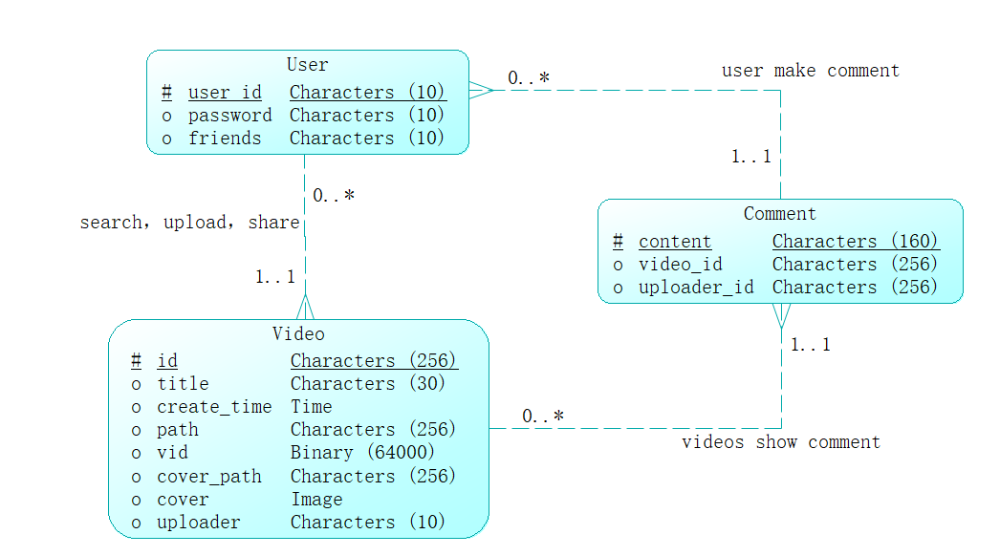

# 数据库LAB2实验报告（数据库需求分析，数据库设计，程序实现

成员:陈金宝、陈湛勘、陈忠昊

### 需求分析：

本次实验设计的是视频浏览网页，实现的功能有：主页视频浏览，用户上传下载视频，用户在视频下方留言，用户订阅其他用户的视频。为此需要数据库存储用户个人信息，网站中视频的信息，视频页面中评论的信息

为此设计数据库：如下图所示：user，comment，video，

## 系统技术架构设计  

视频浏览网页体系结构图：

.png)

### 数据字典与ER图

User表格：

| 字段名称 | 数据长度         | NULL | 备注     |
| -------- | ---------------- | ---- | -------- |
| use_id   | Characters（10） | No   | 用户名   |
| password | Characters（10） | No   | 用户密码 |
| friends  | Characters（10） | No   | 用户订阅 |


视频videos表格：

| 字段名称    | 数据长度          | NULL | 备注                           |
| ----------- | ----------------- | ---- | ------------------------------ |
| id          | Characters（256） | No   | 视频的id自动生成<br />作为主键 |
| title       | Characters（30）  | No   | 视频名称                       |
| create_time | Time              |      | 创建视频的时间                 |
| path        | Characters（256） | No   | 视频存放的路径                 |
| vid         | Binary(64000)     | No   | 视频                           |
| cover_path  | Characters（256） | No   | 封面存放的路径                 |
| cover       | Image             | No   | 封面                           |
| uploader    | Characters（10）  | No   | 上传者的名称                   |

评论comment表格：

| 字段名称    | 数据长度          | NULL | 备注           |
| ----------- | ----------------- | ---- | -------------- |
| content     | Characters（160） |      | 评论           |
| video_id    | Characters（256） | No   | 发表评论的视频 |
| uploader_id | Characters（256） | Np   | 发表评论的用户 |



数据流程图：

.png)

## 前端设计

为了保持统一风格，前端所有页面均继承自`base.html`。本应用中所有操作均需在登录的情况下进行。当检测到未登录时会跳转到登录界面。下面介绍前端的功能。html源码在`shortvids/templates/`下

### login
登录界面需要用户输入用户名和密码，提交表单。提交后若验证成功则跳转到主页`index/`。登录失败时会在网页上显示对应的提示信息。

登录界面样例展示:


登录失败时提示页面样例展示：

- 密码错误时


- 用户不存在时


登录成功则跳转到主页。登录成功后导航栏上有更多信息展示，包括当前在线、搜索、上传、登出等。详细见下。

### register
注册页面用户需要输入用户名、密码、二次确认密码并提交表单。提交后若注册成功则跳转到主页`index/`。注册失败时会在网页上显示对应的提示信息

注册页面样例展示:


注册失败时提示页面样例展示：
- 两次密码不一致时


- 用户已经存在时:


其他可能导致注册失败的情况还有：用户名、密码超过长度限制。提示形式与上类似

### index

该界面展示数据库中的所有视频封面，并附上链接供跳转

样例展示:


以每排三个视频的形式进行展示。视频右侧为该视频链接。点击链接进入单个视频页面。

### search

search页面提供两种搜索方式，第一种是按照视频名称进行搜索，搜索方式为关键字搜索，需要输入搜索视频名称的一部分，所有包含该部分名称的视频都将被显示出来，第二种方式是按照用户名称进行搜索，所有包含搜索字段的用户将被显示出来。若无结果，则有对应的提示信息。

搜索界面展示:


若搜索视频，搜索内容为test,则返回的结果:


搜索结果的展示方式同index。

若搜索用户，搜索内容为test，则返回的结果:


点击链接可进入该用户页面。

若没有检索到视频，则返回的页面:


没有检索到用户，则返回的页面:


### user

用户主页，显示由该用户上传的视频封面及链接。同时提供订阅按钮，供订阅。

样例展示:


点击订阅按钮后若订阅成功，则显示对应的提示页面：


点击确认之后页面变为如下所示，订阅变为取消订阅(若进入已订阅用户页面，则初始显示即为取消订阅)。


点击取消订阅可取消订阅。

正常情况下不会出现订阅失败的情况。若订阅(取消订阅)失败(如网络原因导致的),则会有如下提示：


### video
单个视频的页面：


可通过视频上方的链接点击进入用户页面。也可在视频页面订阅视频的上传用户。视频下方是视频链接。点击可进行分享（自动复制视频链接）:


视频左下方是评论。包含评论内容和用户，可通过链接进入用户页面。

页面最下方可以进行评论。


在视频右键点击可选择下载视频。

### subscribe

用户可以通过点击订阅其他用户，从而在动态浏览已订阅用户的视频。详细介绍已在user,video中。

### upload 

在index主页，用户可以通过点击上传视频，将自己的视频发布到网站

上传页面：


上传时会检查视频和封面是否是支持的类型，若不是，则会输出提示信息。上传成功则会跳转到主页。

上传失败(如：上传的不是支持的视频)时：


### download

在视频页面，右键视频可以选择下载该视频

### comment

在视频页面下方用户可以进行评论，详情见video。

### dynamic

在动态页面可以查看订阅用户发布的视频


### admin

在地址栏输入`admin`。(比如`127.0.0.1:8000/admin`)进入管理员页面。登录管理员账号后可以对相应项目进行管理。


比如，对user列表进行管理：


## 后端程序实现

本次实验通过django框架搭建视频网站，数据库采用的是MYSQL数据库实现。

### Models

1、er图设计的mysql数据库中的三个models：

```python
from django.db import models
import os
from shortvids import settings


class User(models.Model):
    user_id = models.CharField(max_length=10, primary_key=True)
    password = models.CharField(max_length=10)
    friends = models.ManyToManyField("self", symmetrical=False)

    def __str__(self):
        return self.user_id


class Video(models.Model):
    id = models.AutoField(primary_key=True)
    title = models.CharField(max_length=30, default='untitled')
    create_time = models.DateTimeField(auto_now_add=True)
    path = models.CharField(max_length=256)
    vid = models.FileField(verbose_name="视频", default='settings.MEDIA_ROOT/videos/default.mp4', \
                           upload_to=os.path.join(settings.MEDIA_ROOT, 'videos'))
    cover_path = models.CharField(max_length=256)
    cover = models.ImageField(verbose_name="封面", default='settings.MEDIA_ROOT/images/default.png', \
                              upload_to=os.path.join(settings.MEDIA_ROOT, 'images'))
    uploader_id = models.ForeignKey(User, on_delete=models.CASCADE)

    def __str__(self):
        return self.title


class Comment(models.Model):
    content = models.CharField(max_length=160, default='no comment')
    video_id = models.ForeignKey(Video, on_delete=models.CASCADE)
    uploader_id = models.ForeignKey(User, on_delete=models.CASCADE)

    def __str__(self):
        return self.content
```


### Views

`views.py`对前端的请求进行处理。下面对主要功能进行简述。主要功能均需登录才能进行操作。监测方式为检测当前会话中是否登录(login中设置，见下)。未登录时会跳转到登录页面。

#### vids

```python
def vids(request):
    return redirect('/videos/index/')
```


直接重定向到`/videos/index/`

#### get_all_vids

```python
def get_all_vids(request):
    if request.session.get('is_login', False):
        all_vids = models.Video.objects.all()
        return render(request, 'index.html', {'ref': all_vids, 'MEDIA_URL': settings.MEDIA_URL})

    else:
        return redirect('../login/')
```


处理url为`/index/`的请求。返回主页。包含数据库中的全部视频链接、封面（查询得到全部）。

#### user

```python
def user(request):
    if not request.session.get('is_login', False):
        return redirect('../login/')
    else:
        db_user = models.User.objects.all()
        return render(request, 'user.html', {'users': db_user})
```


处理url为`/user/`的请求。返回当前数据库中的user主页链接。

#### get_single_user

处理url为`user/<str:user_id>/`的请求。根据url中的user_id在数据库中进行查询。若存在，则返回对应的用户页面。否则返回提示信息

#### login

根据用户post的表单在数据库查询。若数据库中不存在相关用户，或密码不正确。则输出提示信息。否则在该会话(session)中设置`is_login`为true，`user_id`为登录的user_id。并跳转到主页。

#### register

根据用户post的表单，在数据库中查询。若用户已经存在，或两次输入密码不一致或用户名、密码长度超过限制，则输出对应的提示信息。否则将该用户信息插入数据库并跳转至主页。

#### logout

```python
def logout(request):
    request.session.flush()
    return redirect('../login/')
```


登出操作会flush当前会话（包括`is_login`和`user_id`）。之后跳转至登录界面。

#### search

根据用户提交的表单信息(视频、用户、query)，在数据库中进行查询。查询方式为`like%{query}%`并忽略大小写。即将包含query的结果查询出来(如,当前数据库中有视频test1,TEST2,1test，用户提交的query为test，则查询结果为test1,TEST2,1test)。并将结果返回。

#### upload

upload会对用户上传的视频和封面进行检查。若类型不支持(支持的视频格式:`mp4 webm ogg`，图片格式:`jpg png jpeg bmp webp`)。则返回对应的提示信息。否则对用户上传的视频和图片进行重命名，（重命名格式为`{user_id}_{name}_{上传时间}`）后存入数据库。之后返回主页。

#### get_single_video

处理url`videos/<int:video_id>`请求。根据video_id在数据库中查询对应视频。若不存在，则返回对应提示信息。否则查找跟该视频相联系的用户、评论。并判断该用户是否在登录用户的订阅列表中。也对用户上传的评论进行处理。若长度超过限度或长度为0则输出对应的提示信息。

#### dynamic

处理url`dynamic`请求。根据当前会话(session)中的user_id获取当前用户订阅的用户。并获取被订阅用户上传的视频并返回。若不存在则输出对应的提示信息。

#### subscribe

处理订阅和取消订阅请求。在前端点击订阅或取消订阅时会发出对应的请求。根据对应请求中的user_id和被订阅用户的user_id来进行处理。将对应用户加到(或移除)当前用户的friends中。成功时返回一个http status为200的response，代表处理成功。此时前端显示“订阅成功(或取消订阅成功)”。否则根据情况返回其他类型的http status。代表处理不成功，数据库中的friend未改变。

下表为不同情况时返回的http status

| 情况                                             | http status |
| ------------------------------------------------ | ----------- |
| 成功                                             | 200         |
| 未登录                                           | 401         |
| 当前用户id为空                                   | 403         |
| 数据库中未找到当前id对应的用户                   | 403         |
| 被订阅(或取消订阅)用户id为空                     | 403         |
| 数据库中未找到被订阅(或取消订阅)用户id对应的用户 | 403         |
| request中的操作类型既不是订阅，也不是取消订阅    | 400         |

## 附注

### 源代码结构及说明

```
shortvids/
		  shortvids/ #包含全局的设置和url
		  static/ #静态资源，如静态图片，js脚本,css。包含bootstrap。
		  templates/ #html模板
		  TestModel/ #models定义(models.py)，后端处理(views.py)，url配置(urls.py)等
```

### 分工说明

```
按实现分工:
基页面:陈金宝
登录:陈金宝
注册:陈金宝
上传:陈金宝
登出:陈金宝
搜索(视频部分):陈金宝
搜索(用户部分):陈忠昊
订阅(合并在用户、视频页面中):陈金宝
动态:陈金宝
主页:陈金宝、陈湛勘
视频页面(含评论、分享等功能):陈忠昊
用户页面:陈忠昊
数据模型:陈湛勘、陈忠昊、陈金宝
ER图:陈湛勘
报告:陈湛勘，陈金宝
```

